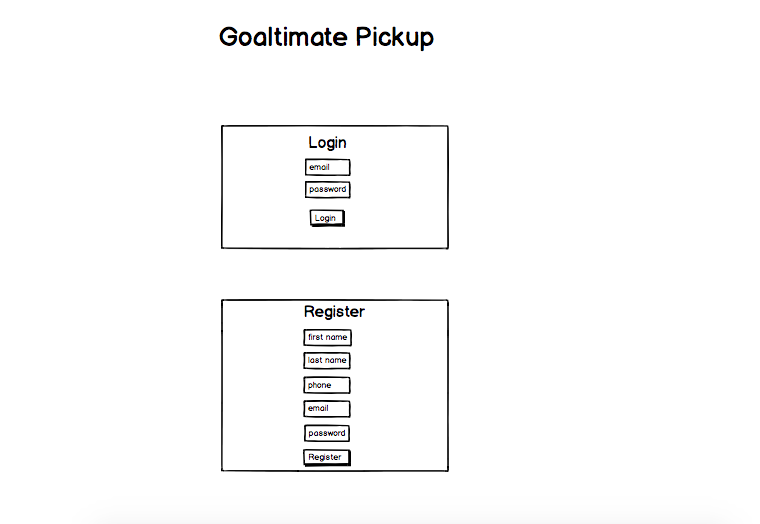
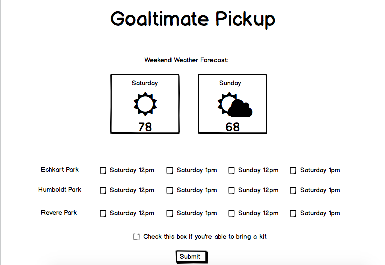

# Goaltimate Pickup
This served as my final project for General Assembly's Web Development Immersive course. This app is intended to aid a group of individuals who regularly play pickup games of Goaltimate on weekends to schedule where and what time the games will occur.

This project is a work in progress. I hope to convert to an express/node.js app.

## Challenges:
I faced a lot more challenges building this application than I thought I would going into it. I chose to use Firebase for storing my data, a technology that was new to me. While the platform markets it's simplicity, the learner curve has proven to be a bit more challenging than anticipated. Some challenges that I encountered:
* __Storage of user email and password separate from rest of data:__

    ⋅⋅⋅As Firebase creates users only with an email and password, I realized that I would need to create a separate table to store the additional user info I wanted to collect. I was able to hard code some data for this connection, however it does not work when a new user registers. I've consulted the Firebase documentation and attempted to use the user creation event listener, but have not been able to successfully execute.

* __Event listener for number of users:__ 

    ⋅⋅⋅As I began working with the database queries to listen for 8+ users to confirm availability for a game, I ran into challenges with accessing my nested data. I am still troubleshooting how to access the list of users for each game event.

* __Problem-Solving:__

	⋅⋅⋅Because I was so focused on trying to accomplish the above two tasks, I ran out of time to work on the additional features that I had planned to incorporate in my app, including connection to weather API, a page to display the current status of time and location votes, and editing user information.

## What I learned:
* Trying something new is *hard*. I bought into Firebase's self-proclaimed ease, but the reality is trying something new always has a learning curve. During this project, I felt very frustrated that I wasn't understanding this quicker. I had decided to use Firebase a day before beginning my project. In the future, I would build in research time to my project plan before committing to use something new.
* It takes much longer to accomplish a full stack app on your own than you anticipate. The previous projects were done with partners with the same timeline, and I operated as if I had someone to share the workload with. In the future, I would better plan my time and be more realistic of what I thinkn I can accomplish.

## In the future, I would like to add:
* Connection to weather API to display the expected conditions for the weekend
* A component to visually represent the current status of location and time voting
* Deleting users in games automatically each week
* On screen and text message notification to users to let them know if a game is on or not for the weekend

## Wireframes:
Registration and login:

Voting for field pickup options page:
